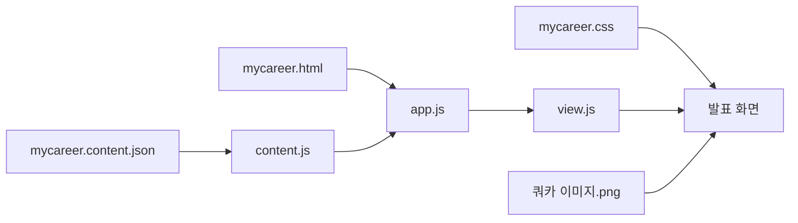

# 커리어 스토리텔링 페이지 수정 안내

## 개념

발표용 한 화면 슬라이드 페이지입니다. HTML은 구조, CSS는 디자인과 반응형 화면, JavaScript는 클릭 이벤트, JSON은 발표 내용을 담당합니다.

## 왜 필요한가

발표 문구를 바꿀 때 화면 구조나 이벤트 코드를 수정하지 않도록 역할을 분리했습니다. 콘텐츠는 브라우저가 기본 지원하는 JSON을 사용하므로 별도 라이브러리가 필요하지 않습니다.

## 파일 구성

| 파일 | 역할 |
| --- | --- |
| `mycareer.html` | HOME, JOURNEY, STRENGTHS, GROWTH 화면 구조 |
| `mycareer.css` | 한 화면 슬라이드, PC·태블릿·모바일 반응형 디자인 |
| `mycareer.content.json` | 모든 발표 문구와 반복 항목 |
| `mycareer/app.js` | JSON과 화면 모듈 연결 |
| `mycareer/content.js` | JSON 불러오기와 필수 배열 검사 |
| `mycareer/view.js` | 연도·사례·역량 선택, 아코디언, 페이지 이동 이벤트 |
| `images/쿼카 이미지.png` | HOME 화면 쿼카 이미지 |

## 실행

```sh
cd /Users/shingme/Documents/PSM/personal
python3 -m http.server 8765 --bind 127.0.0.1
```

브라우저에서 <http://127.0.0.1:8765/mycareer.html>을 엽니다. 종료할 때는 터미널에서 `Ctrl+C`를 누릅니다.

## 공통 문구 수정

반복되는 문구는 `mycareer.content.json` 맨 위의 `dictionary`에서 한 번만 관리합니다. 실제 사용 위치에는 아래처럼 `$ref` 경로가 들어갑니다.

```json
"dictionary": {
  "method": { "problem": "문제 파악" }
},
"title": { "$ref": "dictionary.method.problem" }
```

`문제 파악`을 바꾸려면 `dictionary.method.problem` 값만 수정하세요. `$ref`의 경로명은 유지해야 합니다. 존재하지 않는 경로나 순환 참조가 있으면 페이지에 구체적인 오류가 표시됩니다. 현재 공통 관리 대상은 영역명, 문제 해결 단계명, 여러 영역에 반복되는 프로젝트명입니다.

## 콘텐츠 수정

`mycareer.content.json`만 수정하면 됩니다. JSON의 키, 큰따옴표, 항목 사이 쉼표를 유지하세요. 마지막 항목 뒤에는 쉼표를 넣지 않습니다.

- `home`: 첫 화면 제목, 쿼카 설명, 발표 목차
- `journey.entries`: 연도별 산업과 프로젝트 목록
  - 각 프로젝트는 `title`(프로젝트명), `duration`(표시할 기간), `durationMonths`(크기 계산용 실제 개월 수), `tasks`(수행 내용), `insight`(경험·깨달음)를 가집니다. 기간을 알 수 없으면 `durationMonths`에 `null`을 사용합니다.
  - 같은 연도에 프로젝트가 여러 개면 `projects` 배열에 프로젝트 객체를 추가합니다.
- `strengths.method`: 네 단계 문제 해결 방식
- `strengths.cases`: 세 가지 강점 사례와 단계별 내용
- `growth.capabilities`: AI로 확장할 영역과 직접 책임질 판단
- `growth.foundations`: 기반이 되는 강점
- `growth.priorities`: 더 키울 판단 역량

문구 안 `\n`은 줄바꿈, `**문구**`는 보라색 강조입니다. HTML 태그를 입력하면 코드로 실행하지 않고 일반 문자로 표시합니다.

## 동작구조

1. 처음에는 HOME 화면에서 쿼카 이미지와 세 개 발표 목차를 보여줍니다.
2. JOURNEY는 연도만 보여주고, 연도를 클릭하면 프로젝트 경험과 깨달음이 열립니다.
3. STRENGTHS는 문제 해결 방식을 상단에 두고, 사례를 클릭하면 네 단계 상세 내용이 열립니다.
4. GROWTH는 역량을 클릭하면 AI 활용 영역과 직접 책임질 판단이 열립니다.
5. 기반 강점과 성장 역량은 제목을 클릭해 하나씩 펼칩니다.
6. 모든 하위 페이지의 우측 상단 `HOME`으로 첫 화면에 돌아갑니다.
7. `Page Up`, `Page Down` 키로 발표 화면을 이동할 수 있습니다.

## 관련 개념

[[JSON]], [[ES Modules]], [[반응형 웹]], [[DOM]], [[접근성]], [[관심사 분리]]

## Mermaid 도식


